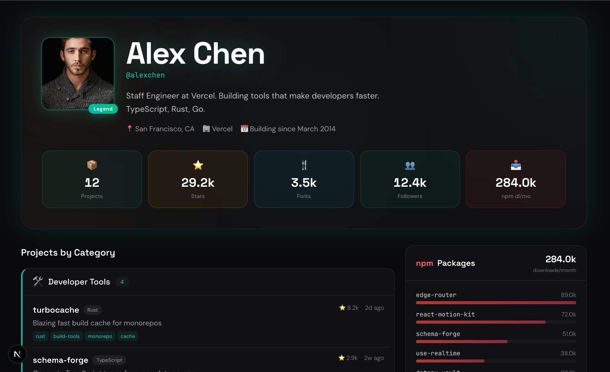

# GitShow — Beautiful Developer Portfolio from Your GitHub Profile

[](https://github.com/ofershap/gitshow/actions/workflows/ci.yml)
[](https://www.typescriptlang.org/)
[](https://nextjs.org/)
[](https://opensource.org/licenses/MIT)

**Your GitHub profile, but way better.** Auto-generated developer portfolio with npm downloads, smart categories, tech stack, and OG social cards.

```
github.com/username  →  gitshow.dev/username
```

Replace `github.com` with `gitshow.dev` in any profile URL. No signup, no config, no deploy.

> Inspired by [GitMCP](https://gitmcp.io) — same URL-swap pattern, but for developer portfolios instead of AI context.



---

## See It In Action

| GitHub Profile | GitShow Portfolio |
|---|---|
| [github.com/sindresorhus](https://github.com/sindresorhus) | [gitshow.dev/sindresorhus](https://gitshow.dev/sindresorhus) |
| [github.com/torvalds](https://github.com/torvalds) | [gitshow.dev/torvalds](https://gitshow.dev/torvalds) |
| [github.com/kelseyhightower](https://github.com/kelseyhightower) | [gitshow.dev/kelseyhightower](https://gitshow.dev/kelseyhightower) |
| [github.com/ThePrimeagen](https://github.com/ThePrimeagen) | [gitshow.dev/ThePrimeagen](https://gitshow.dev/ThePrimeagen) |

---

## What GitHub Doesn't Show (But GitShow Does)

| Feature | What you see |
|---------|-------------|
| **npm downloads** | Total downloads/month across all your packages, with per-package bar chart |
| **Smart categories** | Repos auto-grouped: MCP Servers, CLI Tools, React & UI, DevOps, i18n... |
| **Focus areas** | Aggregated topic cloud showing what you specialize in |
| **Project timeline** | When you shipped projects — your creation velocity |
| **Tech stack bar** | Visual language breakdown across all repos |
| **Aggregate stats** | Projects, stars, forks, followers, npm downloads — one glanceable row |
| **OG social card** | Dynamic 1200×630 image with stats and categories — looks great when shared |
| **Share buttons** | One-click share to X, LinkedIn, or copy link |

Forks and archived repos are automatically filtered out. Only your original work is shown.

---

## URL Patterns

All of these work:

```
gitshow.dev/username                              # direct
gitshow.dev/?url=https://github.com/username      # query param
gitshow.dev/?https://github.com/username           # bare prefix
```

---

## Architecture

```
Browser request
    ↓
Next.js App Router (Vercel Edge)
    ↓
GitHub REST API (/users, /repos)  +  npm Registry API
    ↓
Auto-categorize repos by language, topics, description
    ↓
Server-rendered portfolio page
    ↓
ISR cache (1 hour TTL)
```

| Component | Role |
|-----------|------|
| **Next.js 16** | App Router, Server Components, ISR |
| **React 19** | Zero client JS on portfolio pages (except share/expand) |
| **Tailwind CSS 4** | Dark theme, responsive layout |
| **Vercel OG** | Dynamic social preview image generation (Satori) |
| **GitHub API** | Profile + repos data, cached with `revalidate: 3600` |
| **npm Registry** | Package search + download counts per maintainer |

---

## Deploy Your Own

### One-click Vercel deploy

[](https://vercel.com/new/clone?repository-url=https%3A%2F%2Fgithub.com%2Fofershap%2Fgitshow)

### Or clone and run locally

```bash
git clone https://github.com/ofershap/gitshow.git
cd gitshow
npm install
npm run dev    # → http://localhost:3000
```

### Environment Variables

| Variable | Required | Description |
|----------|----------|-------------|
| `GITHUB_TOKEN` | No | GitHub PAT for higher rate limits (60/hr → 5,000/hr) |

> **Tip:** Without a token, the GitHub API allows 60 requests/hour per IP. If you're deploying publicly, add a token to avoid rate limiting.

---

## Project Structure

```
src/
├── app/
│   ├── page.tsx                    # Landing page — URL swap animation, search
│   ├── layout.tsx                  # Root layout — dark theme, Geist font
│   ├── [username]/
│   │   ├── page.tsx                # Portfolio page (SSR + ISR)
│   │   ├── loading.tsx             # Spinner while loading
│   │   ├── error.tsx               # Error boundary (rate limit, etc.)
│   │   └── not-found.tsx           # 404 for invalid usernames
│   └── api/og/[username]/
│       └── route.tsx               # OG image generation (1200×630 PNG)
├── components/
│   ├── hero-card.tsx               # Avatar, name, bio, aggregate stats + npm
│   ├── category-section.tsx        # Auto-grouped repos with expand/collapse
│   ├── npm-card.tsx                # npm download stats with bar chart
│   ├── tech-stack.tsx              # Language breakdown bar + legend
│   ├── topic-cloud.tsx             # Weighted focus areas cloud
│   ├── activity-graph.tsx          # Project creation timeline
│   ├── share-bar.tsx               # Share to X, LinkedIn, copy link
│   ├── social-links.tsx            # GitHub, Twitter, LinkedIn, website
│   ├── url-swap.tsx                # Animated URL swap (landing page)
│   ├── username-input.tsx          # Search input (landing page)
│   └── footer.tsx                  # Attribution
├── lib/
│   ├── github.ts                   # GitHub API client with caching
│   ├── npm.ts                      # npm registry API client
│   ├── categorize.ts               # Smart repo categorization engine
│   ├── types.ts                    # TypeScript interfaces
│   └── utils.ts                    # formatNumber, timeAgo, getTopRepos
└── proxy.ts                        # URL redirect handler
```

---

## Development

```bash
npm run dev      # Dev server → localhost:3000
npm run build    # Production build
npm run lint     # ESLint
```

---

## Author

**Ofer Shapira**

[](https://linkedin.com/in/ofershap)
[](https://github.com/ofershap)

## License

MIT © [Ofer Shapira](https://github.com/ofershap)
